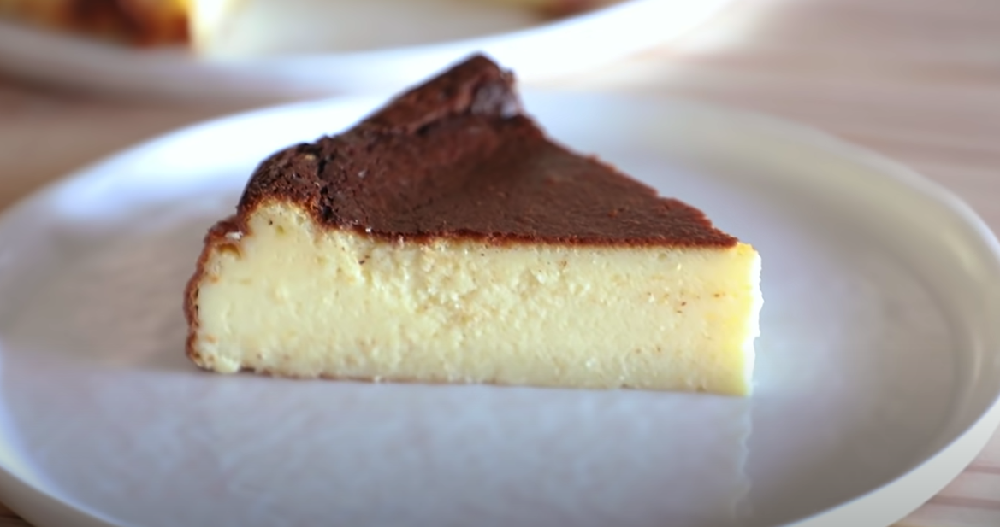
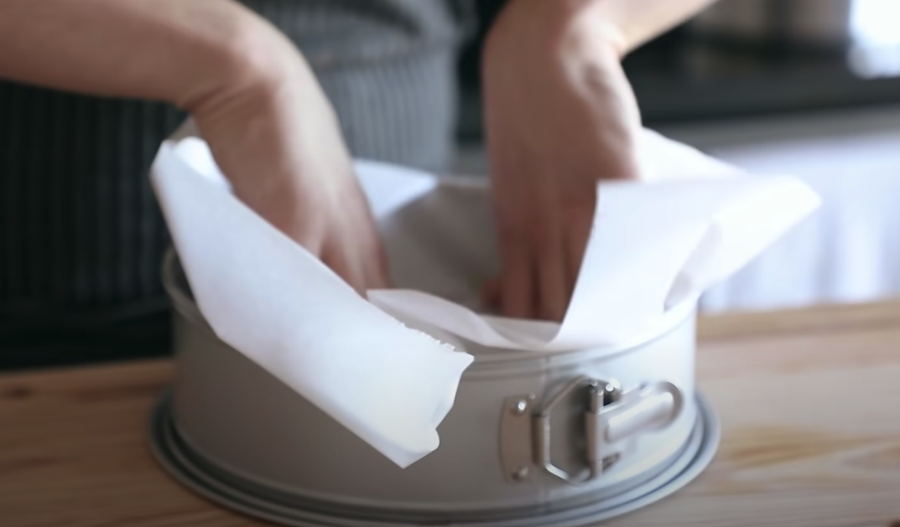
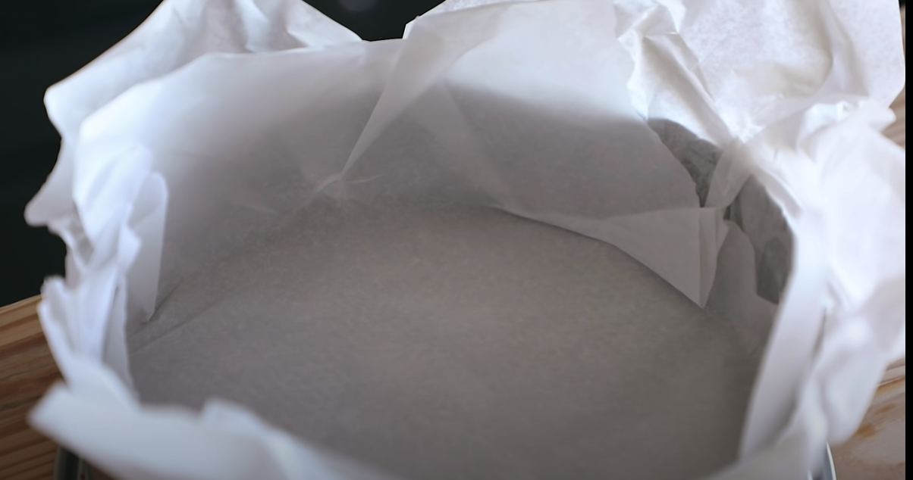

# Basque-style Cheesecake as made by Joshua Weissmann #
###### checkout out the video for more instructions https://www.youtube.com/watch?v=BPHd_-ATQn0

## Ingredients 
*Adapted from a La Viña recipe I found online*
* 1.5lb (678g) cream cheese
* 1/2  pound (226g) mascarpone
* 1.5 cups (320g) sugar
* 6 eggs
* 1 egg yolk
* 3/4 teaspoon 4g fine sea salt
* 1 3/4 cup (415ml) heavy cream
* 1.5 (7g)teaspoons vanilla extract
* 2tsp (9g) orange blossom water (We used rose water and it was killa)
* 1/4 cup plus 2 tbsp (52g) all purpose

## Instructions

#### NOTE: while mixing make sure to scrape down the sides to ensure everything gets mixed well together.

1. Butter up a 10 - or 9 - inch cake pan.
2. Place a large piece of parchment paper flat on top of the cake pan (as though you are trying to cover it) and press it into the pan. 
Essentially you want it to almost mold the inside of the cake pan.

3. Do that again but the other way. You want to inches of overhang all the way around the perimeter of the cake pan. 

4. Add creame cheese (in chunks) and mascarpone to a large bowl (or stand mixer bowl if you have a stand mixer).
5. Mix on medium-low speed and once it smooths out a bit, gradually add the granulated sugar. 
6. Once all sugar is added you can turn up the speed to medium and keep mixing until you get a nice suade-like texture.
7. Add the eggs, one at a time, allowing for them to be incoporated into the mixture inbetween each egg.
8. Add the egg-yolk to the mixture and continue mixing until nicely incoporated. 
9. Add the sea salt, heavy cream, vanilla extract and orange blossom (or rose water) (while continuing to mix)
10. Keep mixing until it's all nice and smooth
11. Once that's done, sift in the all-purpose flour (sifting makes a big difference)
12. Mix again on medium until nice and incorporated.
13. Pour into your previously prepped cake pan, place onto baking sheet and into oven preheated to 400F (205 C) for about an hour
14. (Bake for either an hour or until deep dark-brown)
15. Pull that out (it will be super poofy and jiggly) and let cool in the cake pan (do not unlock the pan)
16. Once it's fallen back in a bit and cooled down unlock the pan and let cool all the way to room temp before pulling the parchment paper off.