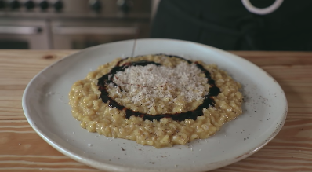

# Joshua Weissman's Beginner Risotto #
###### checkout out the video for more instructions https://www.youtube.com/watch?v=eYIMIP2dIpE

## Ingredients 

* 1-2 Shallots, finely diced
* 3 Garlic cloves, finely minced
* 4.5 cups chickent stock
* 2-3 Tbsp () olive oil 
* Salt
* 1.5 cups Arborio rice
* 1/2 cup white wine
* Pinch of saffron threads, lightly crushed
* 2 tbsp unsalted butter
* 1/3 cup Grana Padano, grated
* Parmigiano Reggiano, grated
* Fresh crack black pepper
* Drizzle of balsamic vinegar glaze (the gooey one)

## Instructions

1. Dice the shallots and mince the garlic if not already
2. Add the chikcen stock to a medium sauce pan and bring up to a boil on medium-high heat. As soon as it reaches a boil, turn off the heat and leave it there so that it's nice and hot and ready for use.
3. Add olive oil into a medium-large sauce pot and heat over medium heat until shimmering. Then add the shallots and garlic, season with salt and sauté for 3-4 minutes (or just until the veggies begin to soften). 
4. Add the rice and toast for about 30 seconds, stirring often. 
5. Add the white wine and the saffron threads. Turn the heeat up to medium-high and boil until it's about 90% evaporated. Turn the heat back down to medium.
6. While continuously stirring the rice base add about half-cup ladel of the hot chicken stock.
7. Once the liquid is absorbed into the rice add another half-cup ladel. WHATEVER YOU DO, KEEP STIRRING!
8. Rinse and repeat until the rice is cooked to an al-dente and no crunch is left. (JW describes the rice as being suspended in a thick custard when it's done.)
9. Turn off the heat and stirr in the butter into the rice. Stir until fully emulsified. 
10. Add the Grana Padano (or Parmegiano Reggiano) and stir a bit.
11. Place risotto on a nice-looking plate and tap plate from the bottom to get the risotto into a nice, circular like shape. 
12. Grate some Parmigiano Reggiano on top and add some pepper.
13. Drizzle some balsamic vinegar. 
